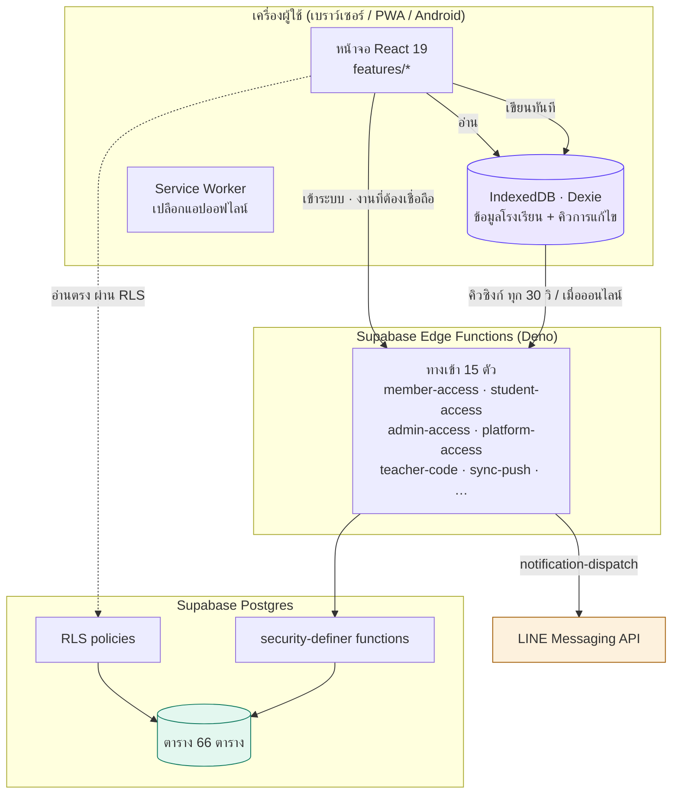
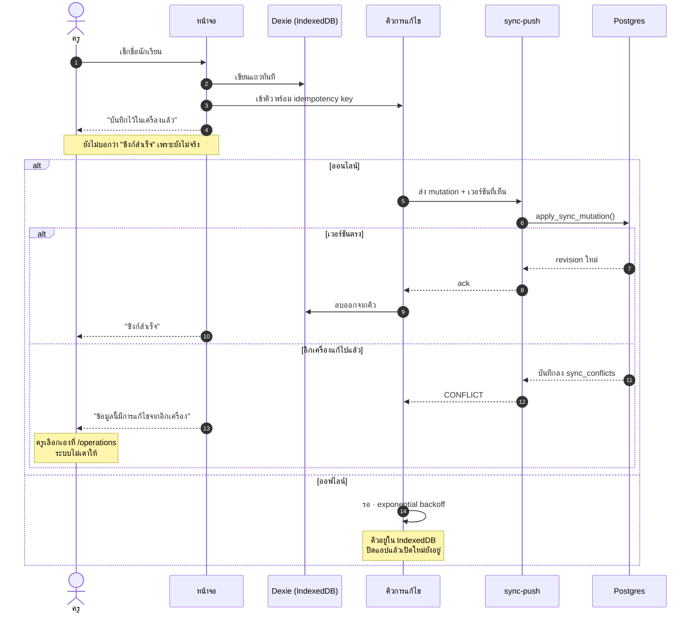
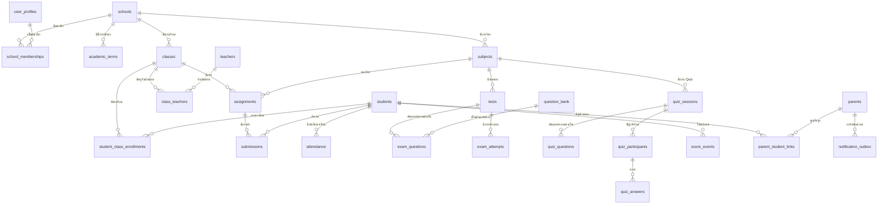
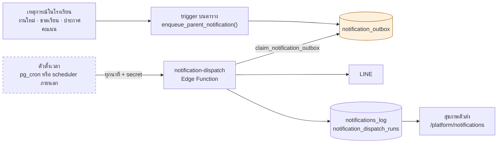
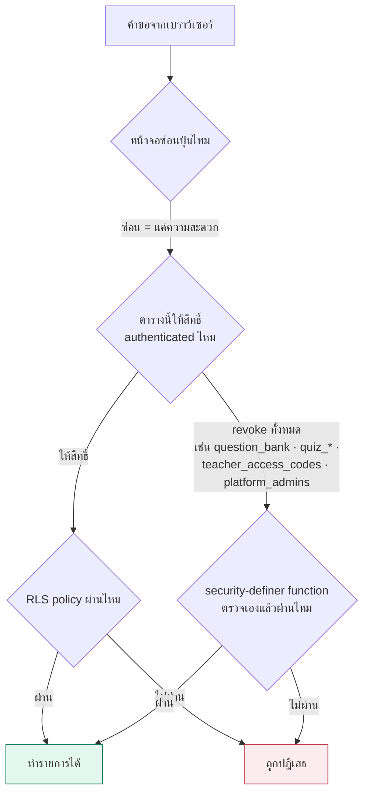

# คู่มือการใช้งานและผังข้อมูลระบบ

เอกสารเดียวที่ตอบสองคำถาม: **ใครใช้หน้าไหนทำอะไร** และ **ข้อมูลเดินทางจากหน้าจอไปถึงฐานข้อมูลอย่างไร**

ปรับปรุงล่าสุด 2026-09-03 · ตรวจกับโค้ดจริงในสาขา `continuation/claude-completion`

> เอกสารนี้อธิบายระบบตามที่โค้ดเป็นอยู่ ไม่ใช่ตามที่ตั้งใจให้เป็น ตัวเลขและรายชื่อหน้าจอมาจากการอ่านไฟล์จริง
> หากพบว่าไม่ตรง ให้เชื่อโค้ดก่อน แล้วแก้เอกสารนี้ — ไม่ใช่ในทางกลับกัน

---

## 1. ระบบนี้คืออะไร

แพลตฟอร์มโรงเรียนหลายโรงเรียน ทำงานเป็นเว็บและ PWA ติดตั้งได้ **ทำงานต่อได้เมื่อออฟไลน์**
โดยเก็บข้อมูลลงเครื่องก่อนแล้วค่อยซิงก์ขึ้น Supabase เมื่อกลับมาออนไลน์

หลักการที่ทั้งระบบยึด และเป็นเหตุผลว่าทำไมโครงสร้างถึงเป็นแบบนี้:

| หลักการ | ความหมายในทางปฏิบัติ |
| --- | --- |
| **สิทธิ์ตัดสินที่ฐานข้อมูล** | หน้าจออาจซ่อนปุ่ม แต่นั่นคือความสะดวก การปฏิเสธที่มีผลจริงคือ RLS policy หรือ security-definer function |
| **Local-first** | เขียนลง IndexedDB ก่อนเสมอ แล้วเข้าคิวซิงก์ · ปิดแอปหรือแบตหมดข้อมูลไม่หาย |
| **เวลาเป็นของเซิร์ฟเวอร์** | หน้าต่างสอบ นาฬิกานับถอยหลัง และวันหมดอายุ อ่านจาก `now()` บนเซิร์ฟเวอร์ เครื่องลูกข่ายแค่วาดตาม |
| **ไม่ลบ เก็บเป็นสถานะแทน** | โรงเรียน บัญชี คำถาม รหัสครู ทุกอย่างมี `status` · ประวัติยังอ่านย้อนหลังได้ |
| **Snapshot ไม่ใช่ pointer** | ข้อสอบและรอบ Quiz คัดลอกคำถามที่ใช้ · แก้คลังข้อสอบเทอมหน้าไม่กระทบข้อสอบที่นักเรียนสอบไปแล้ว |
| **บัญชีคะแนนเดียว** | ทุกอย่างที่ให้คะแนนเขียนลง `score_events` พร้อมเหตุผล ผู้ให้ และแหล่งที่มา |

---

## 2. ทางเข้าสองทาง

ระบบนี้ build ออกมาเป็น **สอง entry แยกกันจริง** ไม่ใช่หน้าเดียวที่ซ่อนเมนู

```
โรงเรียน            /              ผู้ดูแลโรงเรียน · ครู · นักเรียน · ผู้ปกครอง
ศูนย์ควบคุม         /platform/     ผู้ดูแลแพลตฟอร์ม (Super Admin)
```

`INCLUDE_PLATFORM_CONSOLE=false npm run build` จะ **ไม่ build** ศูนย์ควบคุมเลย
ไม่ใช่แค่ซ่อนเมนู — build ที่ส่งให้ลูกค้าจึงไม่มีโค้ดส่วนนั้นอยู่ในเครื่องลูกค้า

---

## 3. ใครเข้าระบบอย่างไร

**ไม่มีทางเข้าไหนถามอีเมล** อีเมลใช้เพื่อกู้รหัสผ่านเท่านั้น

| บทบาท | ใช้อะไรเข้าระบบ | หน้าจอ |
| --- | --- | --- |
| ครู | ชื่อ + รหัสครู (เช่น `SC-001`) | `/login` |
| ผู้ปกครอง | ชื่อ + รหัสผ่าน | `/login` |
| นักเรียน | ชื่อ + เลขประจำตัวนักเรียน (ไม่มีรหัสผ่าน) | `/login` |
| ผู้ดูแลโรงเรียน | ชื่อ + รหัสผ่าน | `/admin-access` |
| เจ้าของระบบ (ครั้งแรก) | รหัสเปิดใช้งาน + ตั้งบัญชี | `/owner/access` |
| ผู้ดูแลแพลตฟอร์ม | ชื่อ + รหัสผ่าน + รหัสสิทธิ์แพลตฟอร์ม (+ รหัส 6 หลัก ถ้าเปิด MFA) | `/platform` |

### รหัสผลิตภัณฑ์ (Product Key)

ลูกค้าที่ซื้อเซิร์ฟเวอร์ได้คีย์ **หนึ่งบัญชีหนึ่งคีย์ สุ่มใหม่ไม่ได้** เปิดหน้าเดิมกี่ครั้งก็ได้คีย์เดิม
คีย์ถูก seal ด้วย AES-GCM ใต้ `PRODUCT_KEY_SECRET` ควบคู่กับ SHA-256 digest ที่ใช้ตรวจตอนเปิดใช้งาน

หากลูกค้าทำหาย: ผู้ดูแลแพลตฟอร์มเปิดอ่านคีย์เดิมได้ที่ `/platform/recovery`
ต้องมีสิทธิ์ + รหัสผ่านสดใน 15 นาที + เหตุผลอย่างน้อย 8 ตัวอักษร แล้วระบบบันทึกทุกครั้งที่เปิดอ่าน

### รหัสผ่าน — สิ่งที่ทำได้และทำไม่ได้

**ไม่มีใครอ่านรหัสผ่านเดิมได้** รวมถึงผู้ดูแลแพลตฟอร์ม เพราะ GoTrue เก็บเป็น one-way hash
สิ่งที่ทำได้คือ **ตั้งรหัสใหม่** ให้ ระบบสุ่มให้ 14 หลัก แสดงครั้งเดียวเพื่ออ่านให้เจ้าของบัญชี
และผู้ดูแลแพลตฟอร์มด้วยกันตั้งรหัสให้กันไม่ได้ — ไม่งั้นคนหนึ่งยึดบัญชีอีกคนได้โดยมีช่องเหตุผลบังหน้า

---

## 4. แต่ละบทบาทใช้อะไร

### ผู้ดูแลโรงเรียน (`admin`)

ทำได้ทุกอย่างในโรงเรียนของตัวเอง และไม่มีอะไรนอกโรงเรียนนั้น

| งาน | หน้าจอ |
| --- | --- |
| ภาพรวมโรงเรียน | `/` |
| นักเรียน ห้องเรียน รายวิชา ครู ผู้ปกครอง | `/students` `/classes` `/subjects` `/teachers` `/parents` |
| นำเข้ารายชื่อจากไฟล์ (CSV/TSV/XLSX) | `/import` |
| เลื่อนชั้นขึ้นปีการศึกษาใหม่ | `/promotion` |
| เช็กชื่อ งาน คะแนน สมุดเกรด | `/attendance` `/assignments` `/scores` `/gradebook` |
| แก้ไขคะแนน | `/grade-editor` |
| คลังข้อสอบ · Quiz · ข้อสอบ | `/question-bank` `/quiz` `/exams` |
| รายงาน | `/reports` |
| Sync · สำรองข้อมูล · แก้ข้อมูลขัดแย้ง | `/operations` |
| ตั้งค่าโรงเรียนและธีม | `/settings` |

### ครู (`teacher`)

เหมือนผู้ดูแล แต่ **ผูกกับความรับผิดชอบที่ได้รับมอบหมาย** ไม่ใช่ทั้งโรงเรียน

ครูมีความรับผิดชอบได้ 4 แบบ และเซิร์ฟเวอร์เป็นคนตรวจ ไม่ใช่หน้าจอ:

| ความรับผิดชอบ | เขียนงาน/คะแนนของวิชานั้นได้ | ดูข้อมูลทั้งห้องได้ |
| --- | --- | --- |
| ครูเจ้าของวิชา (subject owner) | ได้ | ได้ |
| ครูร่วมสอน (co-teacher) | ไม่ได้ | ได้ |
| ครูประจำชั้น (advisor) | ไม่ได้ | ได้ |
| ครูผู้ช่วยประจำชั้น (assistant) | ไม่ได้ | ได้ |

### นักเรียน (`student`)

`/` ภาพรวม · `/assignments` งานที่ต้องส่ง · `/scores` คะแนน · `/gradebook` สมุดเกรด ·
`/sit-exam` เข้าสอบ · `/notifications` แจ้งเตือน · `/leaderboard` · `/achievements` · `/timetable` · `/profile`

รอบ Quiz ที่ครูเปิดในห้องของนักเรียนจะ **โผล่เองทุกหน้า** ไม่ต้องกรอกรหัสเข้าห้อง
เพราะการลงทะเบียนเรียนคือคำเชิญอยู่แล้ว

### ผู้ปกครอง (`parent`)

เห็นเฉพาะบุตรหลานที่โรงเรียนยืนยันความสัมพันธ์และให้ความยินยอมแล้ว

`/my-children` รายชื่อลูก → กดที่การ์ดเข้า `/my-children/:studentId` ซึ่งรวม
**การมาเรียน · งานค้าง · งานเลยกำหนด · ผลรายวิชา · ปฏิทิน** ไว้หน้าเดียว

คะแนนแสดงก็ต่อเมื่อโรงเรียนเปิด `shareScoresWithParents` — ถ้าปิด คะแนนจะ **ไม่ถูกดึงมา** ไม่ใช่ดึงมาแล้วซ่อน

### ผู้ดูแลแพลตฟอร์ม (Super Admin)

| งาน | หน้าจอ |
| --- | --- |
| ภาพรวมทุกโรงเรียน + ผู้ใช้ออนไลน์ | `/platform` |
| โรงเรียนและสุขภาพระบบ | `/platform/schools` |
| สร้างบัญชีผู้ดูแลโรงเรียน | `/platform/admins` |
| คีย์ผลิตภัณฑ์และกู้บัญชี | `/platform/recovery` |
| ศูนย์ข้อผิดพลาด | `/platform/errors` |
| คิวแจ้งเตือน + สุขภาพตัวส่ง | `/platform/notifications` |
| อุปกรณ์ | `/platform/devices` |
| บันทึกความปลอดภัย | `/platform/security` |
| Feature Flags · Releases · MFA | `/platform/platform` |

**Support Mode** ไม่ใช่การสวมรอย — ระบุโรงเรียนเดียว มีเหตุผล หมดอายุตามนาฬิกาเซิร์ฟเวอร์
ให้สิทธิ์ระดับผู้ดูแลโรงเรียนเท่านั้น และ trigger ประทับ session id ลงทุกรายการ audit เอง

---

## 5. ผังระบบ

### 5.1 ภาพรวมสถาปัตยกรรม



### 5.2 ข้อมูลเดินทางอย่างไร (การเขียนหนึ่งครั้ง)



### 5.3 ผังความสัมพันธ์ของข้อมูลหลัก



> `exam_questions` และ `quiz_questions` **คัดลอก** คำถามจาก `question_bank` ไม่ใช่ชี้ไปหา
> แก้คลังข้อสอบเทอมหน้าจึงไม่เปลี่ยนข้อสอบที่ห้องหนึ่งสอบไปแล้ว

### 5.4 การแจ้งเตือนถึงผู้ปกครอง



**เส้นประคือจุดที่ต้องตั้งค่าตอน deploy** โค้ดทั้งหมดพร้อมแล้ว แต่ไม่มีอะไรเรียก function ได้เอง
ถ้าไม่ตั้ง ข้อความจะค้างในคิว — ต่างจากเดิมตรงที่หน้า `/platform/notifications` จะฟ้องว่าตัวส่งเงียบไปกี่นาที

ตั้งด้วยวิธีใดวิธีหนึ่ง:

```sql
-- ในฐานข้อมูล (ต้องเปิด pg_cron และ pg_net)
select public.schedule_notification_dispatch(
  'https://<project-ref>.functions.supabase.co/notification-dispatch',
  '<NOTIFICATION_DISPATCH_SECRET ที่ตั้งไว้บนเซิร์ฟเวอร์>'
);
```

หรือให้ scheduler ภายนอก `POST` ทุกนาทีพร้อม header `x-notification-dispatch-secret`

### 5.5 ชั้นของสิทธิ์



ตารางที่เก็บ **เฉลยหรือความลับ** ถูก `revoke` จาก `authenticated` ทั้งหมด ไม่ใช่กันด้วย policy
เพราะการปฏิเสธด้วย privilege ไม่ต้องพึ่งว่ามีใครเขียน policy ถูกทุกครั้ง

---

## 6. งานประจำวัน — ทำอย่างไร

### ครู: เช็กชื่อ

`/attendance` → เลือกห้องและคาบ → แตะสถานะรายคน → บันทึกลงเครื่องทันที
ทำตอนออฟไลน์ได้ ระบบขึ้น "บันทึกไว้ในเครื่องแล้ว รอซิงก์เมื่อออนไลน์" และซิงก์ให้เองเมื่อกลับมาออนไลน์

### ครู: สั่งงานและตรวจงาน

`/assignments` → สร้างงานใหม่ → เลือกห้อง/วิชา/กำหนดส่ง → เผยแพร่
เมื่อเผยแพร่ trigger จะเข้าคิวแจ้งผู้ปกครองให้เอง ไม่ต้องกดส่งแยก

### ครู: เปิด Quiz ในห้อง

`/quiz` → เลือกวิชา → เลือกจำนวนข้อ (5/10/กำหนดเอง) และวิธีเรียง (ตามลำดับ/สุ่ม/คละความยาก)
→ เริ่ม → นักเรียนในห้องเห็นเองทุกหน้า

คะแนน Quiz **ไม่ใช่คะแนนเก็บ** การให้โบนัสเข้าสมุดคะแนนเป็นการกดแยกอีกครั้ง มีเพดาน และกดซ้ำไม่ได้

### ครู/ผู้ดูแล: นำเข้าคำถามจากไฟล์

`/question-bank` → นำเข้าจากไฟล์ → รองรับ `.csv` `.tsv` `.xlsx`

หัวตารางอ่านได้ทั้งไทยและอังกฤษ เฉลยเขียนได้ 3 แบบ:

| เขียนแบบ | ตัวอย่าง |
| --- | --- |
| ตัวอักษรข้อ | `B` หรือ `A,C` |
| ตัวเลข | `2` หรือ `1,3` |
| ข้อความของตัวเลือกเอง | `กรุงเทพมหานคร` |

แถวที่อ่านไม่ออกจะ **ค้างไว้บนหน้าจอพร้อมเหตุผล** ไม่ถูกทิ้งเงียบ — ไฟล์ 300 ข้อที่เสีย 4 แถว
คือการนำเข้าที่สำเร็จ กับ 4 แถวที่ต้องแก้

### ผู้ดูแล: แก้ข้อมูลขัดแย้ง

`/operations` → รายการที่ขัดแย้ง → ดูทั้งสองฉบับเทียบกันทีละช่อง (เฉพาะช่องที่ต่างกัน)
→ เลือกว่าจะเก็บฉบับใด พร้อมเหตุผล

ระบบ **ไม่ตั้งค่าเริ่มต้นให้** เพราะการเดาแทนคนที่รู้ข้อเท็จจริงคือการทำข้อมูลพังอย่างเงียบ ๆ

### ผู้ปกครอง: ดูลูก

`/my-children` → กดการ์ดของลูก → เห็นการมาเรียน งานค้าง งานเลยกำหนด ผลรายวิชา และปฏิทินในหน้าเดียว

---

## 7. ธีมและการเข้าถึง

| ตั้งค่าได้ | ที่ไหน | มีอะไรบ้าง |
| --- | --- | --- |
| โหมดสี | `/settings` | สว่าง · มืด · ตามระบบ |
| ชุดสีแบรนด์ | `/settings` | 7 ชุด (ม่วง ฟ้า มิ้นต์ ส้ม ชมพู ฟ้าน้ำทะเล เขียว เทา) |
| ความหนาแน่น | `/settings` | ปกติ · แน่น · โปร่ง |

รองรับตามค่าที่เครื่องผู้ใช้ตั้งไว้เอง:

- `prefers-reduced-motion` — ปิด animation ทั้งหมด เหลือแต่การเปลี่ยนสถานะ
- `prefers-color-scheme` — เลือกโหมดมืดให้เองถ้าผู้ใช้ยังไม่ได้เลือกเอง
- จอ ≥1600px (กระดานอินเทอร์แอกทีฟ) — ปุ่มและตัวอักษรใหญ่ขึ้นอัตโนมัติ
- จอ ≤1080px — เมนูกลายเป็นลิ้นชัก + มีแถบเมนูลัดด้านล่าง
- ทุกสถานะบอกด้วย **คำ ไม่ใช่แค่สี** สำหรับผู้ที่แยกสีได้ยาก

---

## 8. สิ่งที่ต้องทำตอน deploy จริง

โค้ดพร้อมทั้งหมด สิ่งเหล่านี้เป็นการตั้งค่าบน project จริงที่ repo ทำแทนไม่ได้

| ลำดับ | สิ่งที่ต้องทำ | ถ้าไม่ทำจะเป็นอย่างไร |
| --- | --- | --- |
| 1 | ตั้ง `PRODUCT_KEY_SECRET` (≥32 ตัวอักษร) | ลูกค้าเปิดใช้งานครั้งแรกไม่ได้ — ระบบปฏิเสธออกคีย์ |
| 2 | ตั้ง `NOTIFICATION_DISPATCH_SECRET` | ตัวส่งแจ้งเตือนปฏิเสธทุกคำขอ |
| 3 | **ตั้งเวลาเรียก `notification-dispatch`** (ดู 5.4) | ข้อความค้างในคิว โรงเรียนเข้าใจว่าแจ้งผู้ปกครองแล้ว |
| 4 | `supabase db push` + deploy Edge Functions | migration ใหม่ยังไม่มีผล |
| 5 | ตั้ง `ALLOWED_ORIGINS` ให้ตรงโดเมนจริง | ทุกคำขอถูก CORS ปฏิเสธ |
| 6 | **ทดสอบกู้คืนข้อมูลจริง** | มีไฟล์สำรองที่ไม่มีใครรู้ว่ากู้ได้จริงหรือไม่ |

รายละเอียดครบใน `docs/21_DEPLOYMENT_RUNBOOK.md`

---

## 9. อยากอ่านต่อ

| เรื่อง | ไฟล์ |
| --- | --- |
| วิธีทำงานกับโค้ดนี้ · ข้อห้ามที่แตะไม่ได้ | `AGENTS.md` |
| สถานะระบบล่าสุด ฟีเจอร์ต่อฟีเจอร์ | `docs/FINAL_SYSTEM_VALIDATION_REPORT.md` |
| ติดตั้ง Supabase ทีละขั้น (ภาษาไทย) | `docs/25_SUPABASE_STEP_BY_STEP_TH.md` |
| ขั้นตอน deploy และการตั้งเวลาแจ้งเตือน | `docs/21_DEPLOYMENT_RUNBOOK.md` |
| รหัสผลิตภัณฑ์และการกู้คืน | `docs/29_PRODUCT_ACTIVATION_KEY.md` |
| build Android | `docs/30_ANDROID_BUILD.md` |
| ตรวจระบบกับฐานข้อมูลจริง | `scripts/probes/README.md` |
| แบบทดสอบก่อนส่งมอบ (ภาษาไทย) | `docs/28_TESTER_FULL_SMOKE_CHECKLIST_TH.md` |
